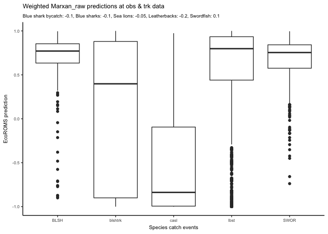
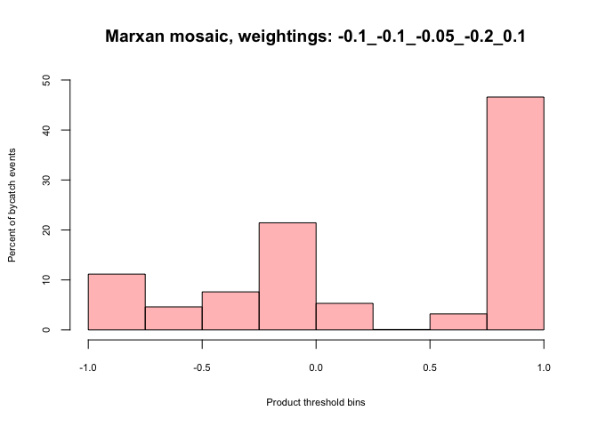
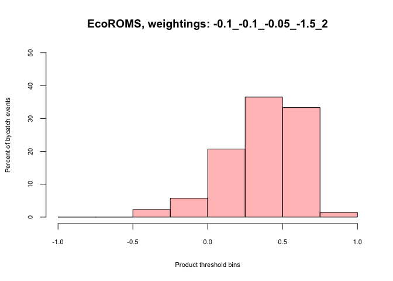
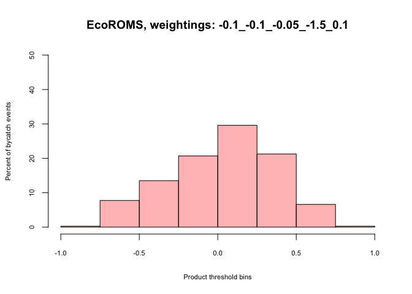
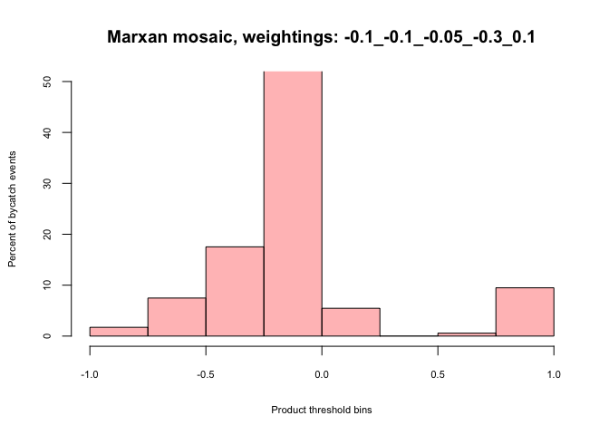
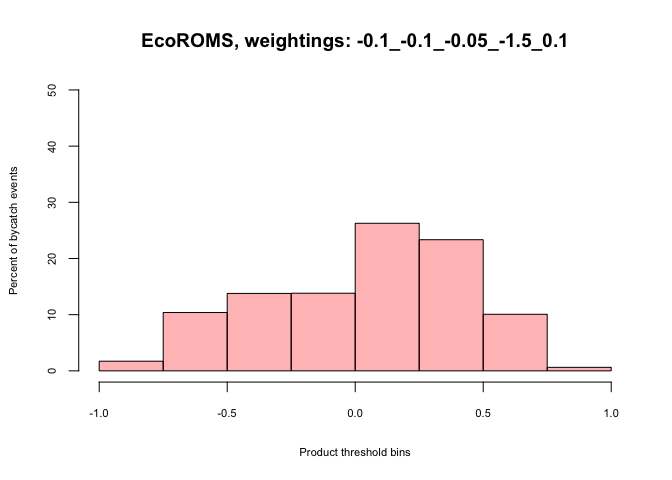
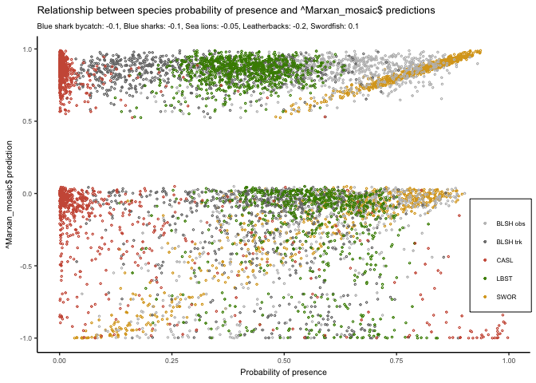
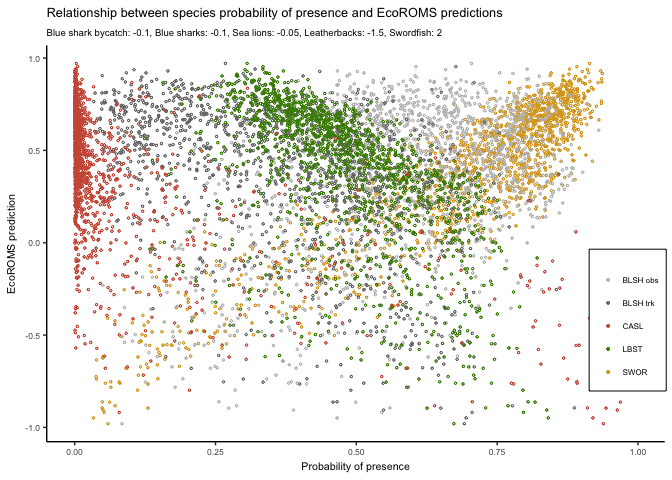
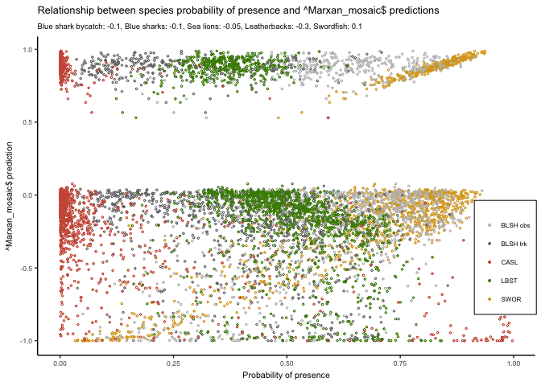

# EcoROMS & EcoMarxan hindcast comparison
Heather Welch  
`r format(Sys.Date())`  

# Introduction
This is a hindcast test of the EcoVerse - a suite of algorithms to reduce bycatch while maximizing target catch in near real-time. 
The hindcast was run between **1997-10-01 and 1997-11-31** and **2005-08-01 and 2005-11-31** in conjunction, two time periods for which there are historical observer and tracking records for each species in the EcoVerse. 

Number of records:  
-blueshark observer = 280  
-blueshark track = 814  
-California sea lion = 34176  
-Leatherback = 2562  
-Swordfish = 348  

Additionally, a random point hindcast was conducted, consisting of 1400 random points between **1997-10-01 and 1997-11-31** and **2005-08-01 and 2005-11-31**. At each random point, all algorithm values were compared to all species habitat suitabilities.

**How the Marxan algorithm works**   
Marxan attempts to solve a min set cover problem, i.e. what is the minimum set of planning units (here 10x10 pixels) needed to meet **targets** for **conservation features** while minimizing **costs**.  
-targets: the bycatch species weightings  
-conservation features: the bycatch species   
-costs: avoided swordfish   

How Marxan is run in EcoMarxan  
Species habitat suitability layers HSL are input into Marxan with the three bycatch species as conservation features and swordfish as a cost. The bycatch species weightings used to set targets for the conservation features (e.g. blsh = .4 ---> protect 40% of blsh habitat). The swordfish weighting is used to set a penalty for failing to meet targets for the conservation features, e.g. when swor is high, the penalty is low, therefor we get a less conservative (in terms of avoiding bycatch) solution. For a given day, Marxan is run 1000 times to create an output of selection frequency, i.e. the number of times / 1000 each pixel was selected for a solution.

Four algorithms were tested:   
**1. EcoROMS** - species habitat suitability layers (HSL) are weighted, summed, and then normalized between -1 and 1   
**2. Marxan raw** - the raw selection frequency output (0-1000) rescaled to (-1,1)   
**3. Marxan mosaic** - remove marxan pixels selected in < 100 solutions, rescale remaining pixels between -1 and 0, where -1= highly selected marxan pixels (e.g. most important for avoiding bycatch); 0=infrequently selected marxan pixels (e.g. least important for avoiding bycatch), fill in removed areas w raw swordfish values from HSL (scaled between 0,1)   
**4. Marxan mosaic 01** - remove marxan pixels selected in < 100 solutions, rescale between -1 and 0, where -1= highly selected marxan pixels (e.g. most important for avoiding bycatch); 0=infrequently selected marxan pixels (e.g. least important for avoiding bycatch), fill in removed areas w swordfish values (unscaled), rescale whole thing between -1,1   

# Run 1 - "generic weightings" - raw data
The generic EcoROMS weightings (-0.1,-0.1,-0.05,-0.9,0.9), and Marxan weightings that produce similar outputs (-0.1,-0.1,-0.05,-0.2,0.1).  
namesrisk<-c("Blue shark bycatch","Blue sharks","Sea lions","Leatherbacks","Swordfish")

## Example alorithm solutions
From 2005-08-01  

## Box plots
Algorithm values at historical records

## Histograms by species

### Swordfish

### Leatherbacks

## Maps by species

### Swordfish

### Leatherbacks

# Run 2 - "SWOR and LBST at their most extremes" - raw data
Weightings in this run were select to seperate swordfish and leatherbacks as much as possible, keeping all other species weightings constant with Run 1. EcoROMS weightings: -0.1,-0.1,-0.05,-1.5,2 ; and Marxan weightings: -0.1,-0.1,-0.05,-0.3,0.6  
namesrisk<-c("Blue shark bycatch","Blue sharks","Sea lions","Leatherbacks","Swordfish")

## Example alorithm solutions
From 2005-08-01  

## Box plots
Algorithm values at historical records

## Histograms by species

### Swordfish

### Leatherbacks

## Maps by species

### Swordfish

### Leatherbacks

# Run 3 - "extreme LBST, neutral SWOR" - raw data
Weightings in this run were select to seperate swordfish and leatherbacks as much as possible, keeping all other species weightings constant with Run 1. EcoROMS weightings: -0.1,-0.1,-0.05,-1.5,.1 ; and Marxan weightings: -0.1,-0.1,-0.05,-0.3,0.1  
namesrisk<-c("Blue shark bycatch","Blue sharks","Sea lions","Leatherbacks","Swordfish")

## Example alorithm solutions
From 2005-08-01  

## Box plots
Algorithm values at historical records

## Histograms by species

### Swordfish

### Leatherbacks

## Maps by species

### Swordfish

### Leatherbacks

# Run 1 - "generic weightings" - random data
The generic EcoROMS weightings (-0.1,-0.1,-0.05,-0.9,0.9), and Marxan weightings that produce similar outputs (-0.1,-0.1,-0.05,-0.2,0.1).  
namesrisk<-c("Blue shark bycatch","Blue sharks","Sea lions","Leatherbacks","Swordfish")

## Example alorithm solutions
From 2005-08-01  

## Point clouds
Habitat suitability layers vs algorithm solutions
 

# Run 2 - "SWOR and LBST at their most extremes" - random data
Weightings in this run were select to seperate swordfish and leatherbacks as much as possible, keeping all other species weightings constant with Run 1. EcoROMS weightings: -0.1,-0.1,-0.05,-1.5,2 ; and Marxan weightings: -0.1,-0.1,-0.05,-0.3,0.6  
namesrisk<-c("Blue shark bycatch","Blue sharks","Sea lions","Leatherbacks","Swordfish")

## Example alorithm solutions
From 2005-08-01  

## Point clouds
Habitat suitability layers vs algorithm solutions
 

# Run 3 - "extreme LBST, neutral SWOR" - random data
Weightings in this run were select to seperate swordfish and leatherbacks as much as possible, keeping all other species weightings constant with Run 1. EcoROMS weightings: -0.1,-0.1,-0.05,-1.5,.1 ; and Marxan weightings: -0.1,-0.1,-0.05,-0.3,0.1  
namesrisk<-c("Blue shark bycatch","Blue sharks","Sea lions","Leatherbacks","Swordfish")

## Example alorithm solutions
From 2005-08-01  

## Point clouds
Habitat suitability layers vs algorithm solutions
 

